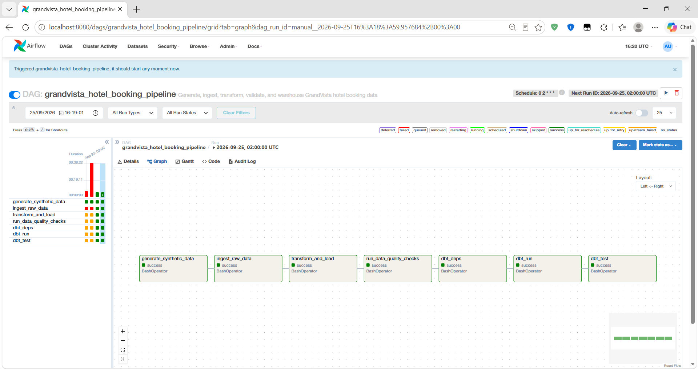
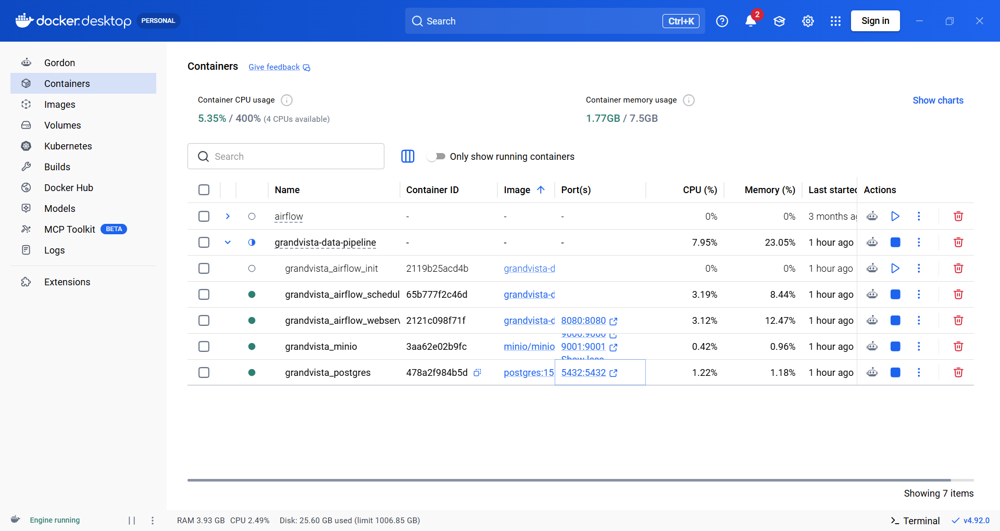
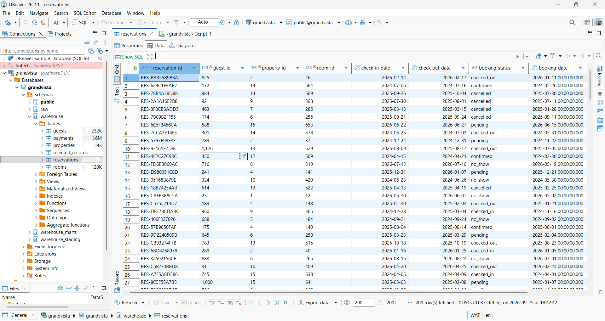

# GrandVista Hotel Booking Data Pipeline

A centralized ETL pipeline that generates, ingests, cleans, validates, models,
and warehouses hotel booking data for GrandVista Hospitality Group — a
fictional multi-property hospitality group whose reservation data is
fragmented across booking platforms, property systems, customer databases,
and payment systems.

## 1. Project Overview

**Business problem:** reservation data (guests, properties, rooms,
reservations, payments) arrives with inconsistent schemas, mixed date
formats, inconsistent status vocabularies, duplicate records, missing
values, and invalid cross-references — because it originates from several
independent systems rather than one clean source.

**Solution:** an automated pipeline that generates a realistic messy source
environment, ingests it into a `raw` staging layer unmodified, transforms
and standardizes it in Python, loads it into a constrained PostgreSQL
`warehouse` schema, runs automated data-quality tests (both a Python
validation layer and dbt tests), and builds documented analytical models —
all orchestrated end-to-end by Apache Airflow.

This project intentionally prioritizes **data integration, data quality,
and pipeline reliability** over analytics — the deliverable is a trustworthy
warehouse, not a dashboard.

## 2. Architecture

```
Faker/Python              raw/*.csv           raw schema         warehouse schema        dbt
generate_data.py  ──────▶  (bronze,       ──▶  (Postgres,   ──▶  (Postgres,        ──▶  staging views
                            unmodified          text-typed,       constrained,             │
                            source data)        exact copy)       typed, FK-enforced)       ▼
                                                                         │              marts (fct/dim/agg)
                                                                         ▼                   │
                                                              warehouse.rejected_records      ▼
                                                              (quarantined bad records)   dbt tests (schema.yml)
```

Orchestrated by an Airflow DAG (`airflow/dags/grandvista_pipeline_dag.py`):

```
generate_synthetic_data
      │
      ▼
ingest_raw_data            (src/ingestion/ingest.py   → raw schema)
      │
      ▼
transform_and_load         (src/transformation/{transform,load}.py → warehouse schema)
      │
      ▼
run_data_quality_checks    (src/validation/validate.py — hard gate, fails the DAG on any check failure)
      │
      ▼
dbt_deps → dbt_run → dbt_test   (dbt/ — staging views + fact/dim/agg models + schema tests)
```

See `docs/architecture.md` for the full rationale and `docs/data_quality.md`
for the quarantine/rejection design.

## 3. Dataset Generation

Synthetic data is generated programmatically with Faker/Pandas/NumPy
(`data/generation/generate_data.py`) rather than hand-entered, and is
**deliberately not clean** — see `docs/data_generation.md` for exactly which
data-quality issues are injected, how many records are produced, and why
each issue represents a realistic source-system problem.

```bash
cd data/generation
python generate_data.py --seed 42 --out-dir ../raw
```

Produces (at the default seed): ~1,236 guests, 15 properties, ~690 rooms,
~8,120 reservations, ~9,400 payments.

## 4. Data Model

| Table | Grain | Key relationships |
|---|---|---|
| `guests` | one row per guest | referenced by `reservations.guest_id` |
| `properties` | one row per hotel | referenced by `rooms.property_id`, `reservations.property_id` |
| `rooms` | one row per room | belongs to a `property`; referenced by `reservations.room_id` |
| `reservations` | one row per booking | references `guest`, `property`, `room`; referenced by `payments.reservation_id` |
| `payments` | one or more rows per reservation | references `reservation` |

```
Guests ──< Reservations >── Properties
             │                  │
             ▼                  ▼
          Payments             Rooms
```

Full DDL: `sql/schema/schema.sql`. dbt builds `stg_*` passthrough/documentation
views over the warehouse tables, then `fct_reservations`, `dim_guests`, and
`agg_property_performance` on top (`dbt/models/`).

## 5. Technology Stack

| Layer | Tool | Purpose |
|---|---|---|
| Database | PostgreSQL 15 | Centralized relational warehouse (`raw` + `warehouse` schemas) |
| Data generation | Python, Faker | Realistic synthetic source datasets |
| Data processing | Python, Pandas | Extraction, cleaning, transformation, validation |
| Orchestration | Apache Airflow | Pipeline scheduling, dependencies, retries, failure handling |
| Transformation/testing | dbt Core | SQL modeling layer + schema-level data-quality tests |
| Storage | MinIO | Local S3-compatible object storage (staged for raw-file archival) |
| Containerization | Docker / Docker Compose | Reproducible local environment |
| Testing | pytest | Unit tests for transformation logic |

## 6. Setup Instructions

### Prerequisites
- Docker Desktop
- (optional, for running scripts outside containers) Python 3.11+

### Steps

```bash
git clone <this-repo>
cd grandvista-data-pipeline
cp .env.example .env          # adjust credentials if you want
docker compose up -d --build
```

This starts:
- `postgres` — hosts both the Airflow metadata DB and the `grandvista` warehouse DB (created automatically by `docker/init-multi-db.sh`, schema applied from `sql/schema/schema.sql`)
- `minio` — S3-compatible storage, console at http://localhost:9001 (`minioadmin` / `minioadmin`)
- `airflow-webserver` — UI at http://localhost:8080 (`admin` / `admin`)
- `airflow-scheduler` — executes the DAG

`Dockerfile.airflow` extends the official Airflow image with this project's
dependencies (`requirements.txt`). Two details matter there and are
documented inline in the file: it installs `build-essential`/`libpq-dev`
before the pip install (dbt-postgres needs Postgres's `pg_config` to build
`psycopg2` from source), and it installs against Airflow's own published
constraints file rather than plain `requirements.txt` versions — without
that, pip is free to install a SQLAlchemy/pandas version that satisfies
this project's dependencies but silently breaks Airflow's own internals.
That's also why `requirements.txt` leaves `pandas`/`SQLAlchemy` unpinned:
the constraints file picks the actual compatible version.

First build takes several minutes (compiling `psycopg2` from source and
installing dbt). If you hit a `docker compose build` error, it's almost
always a version conflict between something in `requirements.txt` and
Airflow's constraints file — the error names the conflicting package;
unpinning that package's version in `requirements.txt` and rebuilding with
`--no-cache` resolves it.

## 7. Execution Instructions

**Option A — via Airflow (recommended, matches the intended production flow):**

1. Open http://localhost:8080, log in as `admin` / `admin`.
2. Unpause `grandvista_hotel_booking_pipeline`.
3. Trigger it manually (▶) or wait for its daily schedule.
4. Watch tasks run in order: `generate_synthetic_data → ingest_raw_data →
   transform_and_load → run_data_quality_checks → dbt_deps → dbt_run → dbt_test`.

**Option B — running stages manually (for local development/debugging):**


1. Generate the datasets
```bash
python data/generation/generate_data.py --out-dir data/raw
```
2. Start just Postgres if you're not using the full compose stack
```bash
docker compose up -d postgres
```
3. Ingest raw data
```bash
python src/ingestion/ingest.py --raw-dir data/raw
```
4. Transform + load into the warehouse
```bash
python src/transformation/load.py --raw-dir data/raw
```
5. Run data quality checks (exits non-zero on failure)
```bash
python src/validation/validate.py
```
6. Run dbt models + tests
```bash
cd dbt && dbt deps --profiles-dir . && dbt run --profiles-dir . && dbt test --profiles-dir .
```
7. Access the warehouse
```bash
psql -h localhost -U grandvista -d grandvista   # password: grandvista (see .env)
```

## 8. Screenshots

Screenshots of the running stack live in `docs/screenshots/`. :

| File | Shows |
|---|---|
| `docs/screenshots/docker.png` | `docker compose ps` — all containers healthy/running |
| `docs/screenshots/airflow-dag-graph.png` | The DAG graph view in the Airflow UI, all tasks green |
| `docs/screenshots/postgres-warehouse.png` | The `warehouse.reservations` showing loaded data |

<p align="center">
  <br>
  <em>grandvista_hotel_booking_pipeline running end-to-end in Airflow</em>
</p>

<p align="center">
  <br>
  <em>All services (Postgres, MinIO, Airflow webserver/scheduler) running via Docker Compose</em>
</p>

<p align="center">
  <br>
  <em>Standardized reservation data loaded into warehouse.reservations</em>
</p>


## 9. Data Quality

See `docs/data_quality.md` for the full list of checks and how failures are
handled. In short: nothing is silently dropped — every record that fails a
check is written to `warehouse.rejected_records` with a reason, so the
pipeline's cleaning decisions are fully auditable.

## 10. Testing

```bash
pip install -r requirements.txt -r requirements-dev.txt
pytest tests/ -v
```

`pytest` is kept in a separate `requirements-dev.txt` rather than
`requirements.txt`, since it's a local dev/test tool with no reason to be
installed inside the Airflow image — see `docs/technical_decisions.md` for
why that split (and the Airflow-image dependency-pinning approach more
generally) mattered in practice.

25 unit tests cover status/date normalization, required-field enforcement,
foreign-key validation, and deduplication logic in the transformation layer.

## 11. Repository Structure

```
grandvista-data-pipeline/
├── data/
│   ├── raw/                    # generated source CSVs (bronze)
│   └── generation/
│       └── generate_data.py
├── src/
│   ├── ingestion/ingest.py
│   ├── transformation/
│   │   ├── transform.py        # pure-pandas cleaning logic (unit tested)
│   │   └── load.py             # writes to warehouse + rejected_records
│   └── validation/validate.py  # Python-native data quality gate
├── airflow/dags/grandvista_pipeline_dag.py
├── dbt/
│   ├── models/staging/         # stg_* views + sources.yml + tests
│   └── models/marts/           # fct_reservations, dim_guests, agg_property_performance
├── sql/schema/schema.sql       # raw + warehouse DDL
├── docs/
│   ├── architecture.md
│   ├── data_quality.md
│   ├── data_generation.md
│   ├── technical_decisions.md
│   └── screenshots/             # pipeline run screenshots (see §8)
├── tests/test_transform.py
├── Dockerfile                   # pipeline runtime image
├── Dockerfile.airflow           # Airflow image + project dependencies
├── docker-compose.yml
├── requirements.txt              # installed inside the Airflow image
├── requirements-dev.txt          # local-only tooling (pytest)
├── .env.example
└── .gitignore
```

## 12. Limitations & Assumptions

See `docs/architecture.md` §"Limitations, Assumptions & Extending the Pipeline"
for a full discussion of what's simplified for this assessment (e.g. no
incremental/CDC loading, no MinIO write step yet wired into the DAG, single
Postgres instance hosting both Airflow metadata and the warehouse) and how
each would be addressed for production/larger data volumes.
